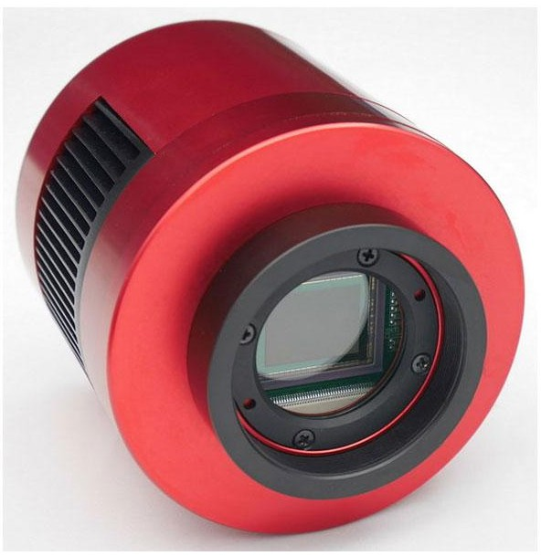

.. _camera-zwo:

Zwo (Zhen Wang Optical)
-----------------------




Introduction
````````````

ZWO offers a large choice of cameras for astronomical applications. The cameras
are connected via USB. The delivered driver library is available for Linux,
Mac, and Windows.

The LImA module has been tested with the ASI 178MM-Cool model on Linux.

Prerequisite
````````````

Installation & Module configuration
```````````````````````````````````

-  follow first the steps for the linux installation :ref:`linux_installation`
-  follow first the steps for the windows installation :ref:`windows_installation`

The minimum configuration file is *config.inc* :

.. code-block:: sh

 COMPILE_CORE=1
 COMPILE_SIMULATOR=0
 COMPILE_SPS_IMAGE=1
 COMPILE_ESPIA=0
 COMPILE_FRELON=0
 COMPILE_MAXIPIX=0
 COMPILE_PILATUS=0
 COMPILE_BASLER=0
 COMPILE_PROSILICA=0
 COMPILE_ROPERSCIENTIFIC=0
 COMPILE_MYTHEN=0
 COMPILE_ADSC=0
 COMPILE_UEYE=0
 COMPILE_XH=0
 COMPILE_XSPRESS3=0
 COMPILE_XPAD=0
 COMPILE_PERKINELMER=0
 COMPILE_ANDOR=0
 COMPILE_PHOTONICSCIENCE=0
 COMPILE_PCO=0
 COMPILE_MARCCD=0
 COMPILE_POINTGREY=0
 COMPILE_IMXPAD=0
 COMPILE_DEXELA=0
 COMPILE_ZWO=1
 COMPILE_RAYONIXHS=0
 COMPILE_CBF_SAVING=0
 COMPILE_NXS_SAVING=0
 COMPILE_FITS_SAVING=0
 COMPILE_EDFGZ_SAVING=0
 COMPILE_TIFF_SAVING=0
 COMPILE_CONFIG=1
 LINK_STRICT_VERSION=0
 export COMPILE_CORE COMPILE_SPS_IMAGE COMPILE_SIMULATOR \
       COMPILE_ESPIA COMPILE_FRELON COMPILE_MAXIPIX COMPILE_PILATUS \
       COMPILE_BASLER COMPILE_PROSILICA COMPILE_ROPERSCIENTIFIC COMPILE_ADSC \
       COMPILE_MYTHEN COMPILE_UEYE COMPILE_XH COMPILE_XSPRESS3 COMPILE_XPAD COMPILE_PERKINELMER \
       COMPILE_ANDOR COMPILE_PHOTONICSCIENCE COMPILE_PCO COMPILE_MARCCD COMPILE_DEXELA COMPILE_ZWO\
       COMPILE_POINTGREY COMPILE_IMXPAD COMPILE_RAYONIXHS COMPILE_CBF_SAVING COMPILE_NXS_SAVING \
       COMPILE_FITS_SAVING COMPILE_EDFGZ_SAVING COMPILE_TIFF_SAVING COMPILE_CONFIG\
       LINK_STRICT_VERSION

-  start the compilation :ref:`linux_compilation`

-  finally for the Tango server installation :ref:`tango_installation`

Initialisation and Capabilities
```````````````````````````````
In order to help people to understand how the camera plugin has been implemented
in LImA this section provide some important information about the developer's
choices.

Camera initialisation
.....................

TODO

Std capabilites
...............

This plugin has been implement in respect of the mandatory capabilites but with
some limitations according to some programmer's  choices.  We only provide here
extra information for a better understanding of the capabilities for the Zwo
camera.

* HwDetInfo
  
TODO

* HwSync

TODO  
  

Optional capabilites
....................

In addition to the standard capabilities, we make the choice to implement some
optional capabilities in order to have an improved simulation.

TODO

* BinCtrl

  TODO

* BufferCtrl

  TODO

* FlipCtrl

  TODO

* RoiCtrl

  TODO

* ShutterCtrl

  TODO

* SavingCtrl

  TODO

* VideoCtrl

  TODO

Configuration
`````````````

TODO


How to use
``````````
The LimaCCDs tango server provides a complete interface to the zwo plugin so
feel free to test.

For a quick test one can use python, is this a short code example:

.. code-block:: python

  from Lima import Zwo
  from lima import Core
  import time

  cam = Zwo.Camera(0)
  hwint = Zwo.Interface(cam)

  control = Core.CtControl(hwint)

  acq = control.acquisition()

  # setting new file parameters and autosaving mode
  saving = control.saving()

  pars = saving.getParameters()
  pars.directory = '/tmp/'
  pars.prefix = 'testsimul_'
  pars.suffix = '.edf'
  pars.fileFormat = Core.CtSaving.EDF
  pars.savingMode = Core.CtSaving.AutoFrame
  saving.setParameters(pars)

  # now ask for 2 sec. exposure and 10 frames
  acq.setAcqExpoTime(2)
  acq.setNbImages(10) 
  
  control.prepareAcq()
  control.startAcq()

  # wait for last image (#9) ready
  lastimg = control.getStatus().ImageCounters.LastImageReady
  while lastimg != 9:
      time.sleep(0.1)
      lastimg = control.getStatus().ImageCounters.LastImageReady
 
  # read the first image
  im0 = control.ReadImage(0)
